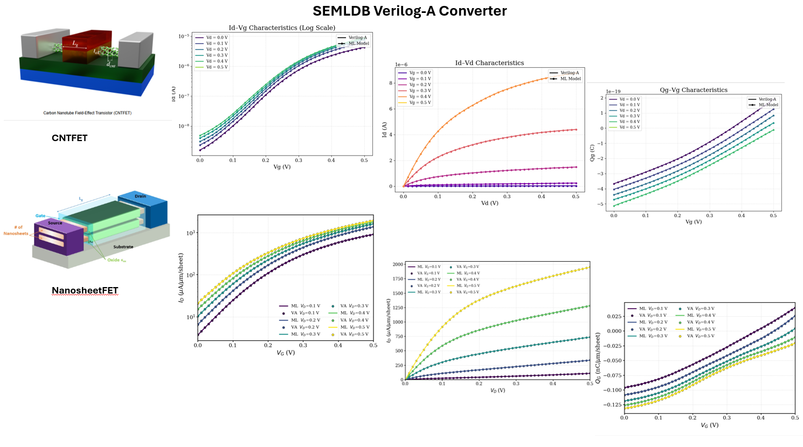

# SEMLDB Verilog-A

Machine-learning-based compact device models exported as **Verilog-A** for Cadence Virtuoso / Spectre simulation.



This repository contains:

1. **Pre-built Verilog-A models** ready to drop into Cadence.
2. **A converter tool** that regenerates or creates new Verilog-A files from trained PyTorch checkpoints.

---

## Supported Devices

| Device | Description | Converter Architecture |
|--------|-------------|------------------------|
| SiFET | Silicon FET | `SiFET` |
| CNTFET | Carbon Nanotube FET | `CNTFET` |
| 2DFET | 2D Material FET | `2DFET` |
| HFET | Hydrogen-terminated Diamond FET | `HFET` |
| DiamondFET | Diamond FET | `DiamondFET` |
| NMOS | NMOS Transistor | `NMOS` |

---

## Repository Structure

```
SEMLDB_VLA/
├── models/           # Ready-to-use Verilog-A files for Cadence
│   ├── SiFET/
│   ├── CNTFET/
│   ├── HFET/
│   ├── DiamondFET/
│   └── NMOS/
│
├── converter/        # ML-to-Verilog-A conversion tool
│   ├── architectures/    # One plugin per device type
│   ├── checkpoints/      # Trained PyTorch weights (.pth)
│   ├── outputs/          # Generated .va files
│   └── universal_export.py
│
└── README.md         # (this file)
```

---

## Quick Start

### Use a pre-built model in Cadence

Go to [models/](models/) — each subfolder contains a Verilog-A file (and any companion `.txt` data files) that can be imported directly into Cadence Virtuoso as a `veriloga` cellview.

See [models/README.md](models/README.md) for setup instructions, path configuration, and troubleshooting.

### Regenerate or create a new model

Go to [converter/](converter/) — the converter takes a trained PyTorch checkpoint and produces a Spectre-compatible `.va` file automatically.

See [converter/README.md](converter/README.md) for usage, architecture plugin development, and export examples.

---

## Requirements

- **Python 3.8+** with PyTorch and NumPy (for the converter)
- **Cadence Virtuoso / Spectre** (to simulate the generated models)
